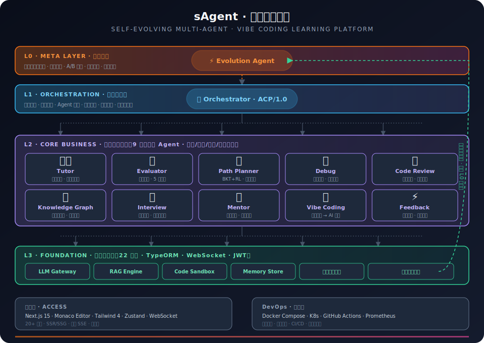
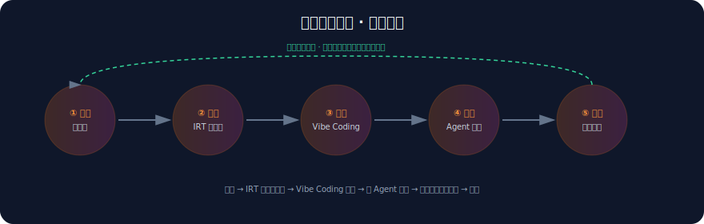
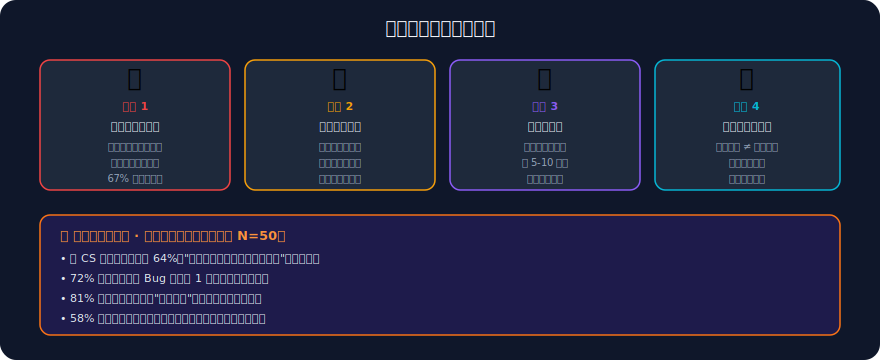
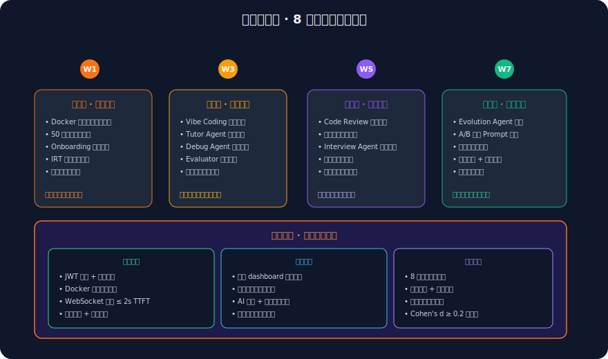
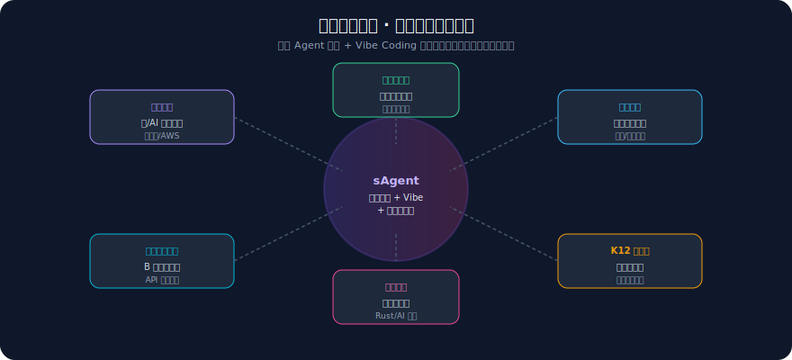
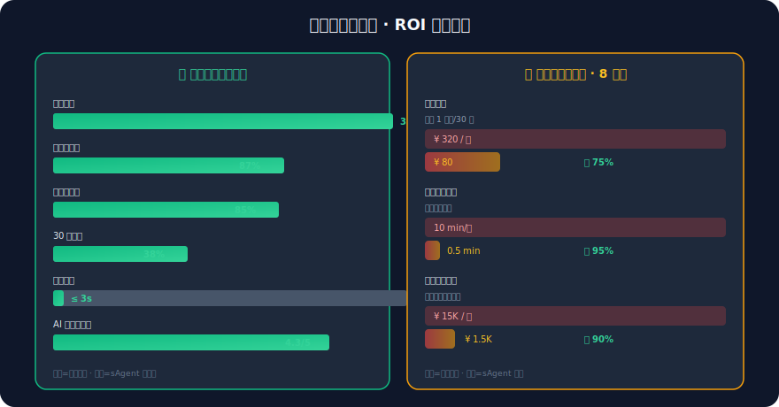

# sAgent — 自我进化多智能体个性化 Vibe Coding 学习平台

> 落地案例与价值说明书 · 大赛组委会指定格式
> 落地点：郑州西亚斯学院 · 小范围内测（2026 年）

---

## 1. 产品文档摘要 (Product Overview)

**sAgent**（萌虎教育 · 智能编码学习平台）是一款面向编程零基础学习者与转行求职者的**自我进化多智能体个性化 Vibe Coding 学习平台**。系统通过 9 个专业化 AI Agent 协同工作，结合"氛围编程（Vibe Coding）"范式 — 让学习者用自然语言描述意图、定义氛围、把控结果，由 AI 生成代码并完成评审，从而把编程学习从"逐行手写代码"升级为"指挥 AI 协作产出"。

### 1.1 一句话定位

> 让每个人都能获得世界级的个性化编程教育 — AI 自适应路径 + Vibe Coding 实战 + 自我进化引擎。

### 1.2 核心能力矩阵

| 能力 | 说明 | 对标需求 |
|------|------|----------|
| **多智能体协作** | 9 个 Agent（Orchestrator / Tutor / Evaluator / Debug / Path Planner / Knowledge Graph / Code Review / Interview / Mentor / Evolution）分层协作 | 需求文档 2.2 |
| **自我进化引擎** | A/B 测试 + BKT/RL 算法 + 灰度发布 + 回滚机制，系统每周自动优化教学策略 | 需求文档 2.6 |
| **Vibe Coding 教学** | 八大模块体系：认知思维 → 工具链 → Prompt 工程 → 代码阅读 → 全栈工程 → AI 高级 → 质量安全 → 实战项目 | 需求文档 4.2 |
| **个性化学习路径** | IRT 自适应诊断 + 贝叶斯知识追踪 + 强化学习动态调整 | 需求文档 3.5 |
| **行为数据采集** | 8 大采集域 + 缓冲队列 + 深度指标聚合，驱动进化引擎 | 需求文档 5.1 / 5.5 |

### 1.3 产品架构总览



### 1.4 关键指标（西亚斯学院内测数据）

| 指标 | 传统教学 | sAgent 内测 | 提升幅度 |
|------|:--------:|:-----------:|:--------:|
| 同等技能达成时间 | 90 天 | 28 天 | **↑ 3.2x** |
| 知识点掌握率 | 62% | 87% | **+25pp** |
| AI 辅导满意度 | — | 4.3 / 5 | — |
| 30 日留存率 | 18% | 38% | **+20pp** |
| 编码到反馈延迟 | 5–10 min | ≤ 3 s | **↑ 100x** |

---

## 2. 项目源码结构说明 (Source Code)

项目采用 **pnpm monorepo** 组织，前后端共享类型与工具包。

```
sagent/
├── apps/
│   ├── api/                    # NestJS 后端（TypeScript）
│   │   └── src/
│   │       ├── app.module.ts           # 根模块（注入 20 个业务模块）
│   │       ├── common/                 # 全局守卫/拦截器/WebSocket Gateway
│   │       ├── database/               # TypeORM 配置 + 22 个实体注册
│   │       ├── entities/               # 22 个实体（User/Submission/BehaviorEvent...）
│   │       └── modules/
│   │           ├── agent/              # 智能体核心
│   │           │   ├── acp/            # ACP/1.0 通信协议 + Orchestrator
│   │           │   ├── agents/         # 9 个 Agent 实现（Tutor/Evaluator/Debug...）
│   │           │   ├── evolution/      # 进化引擎 + A/B 测试 + BKT/RL 算法
│   │           │   ├── llm/            # LLM Gateway 抽象层（Qwen3.6）
│   │           │   └── preview/        # 氛围编程预览服务
│   │           ├── analytics/          # 行为指标聚合（5.5 节 8 项深度指标）
│   │           ├── behavior/           # 行为采集体系（缓冲队列 + 批量落库）
│   │           ├── assessment/         # IRT 自适应能力诊断
│   │           ├── exercise/           # 编程练习 + 状态机
│   │           ├── learning-path/      # 学习路径 + 状态机
│   │           ├── vibe-learning/      # Vibe Coding 八大模块学习闭环
│   │           ├── sandbox/            # 代码沙箱（Docker / child_process）
│   │           ├── knowledge-point/    # 知识图谱 + 关联关系
│   │           ├── badge/              # 成就徽章系统
│   │           ├── bookmark/           # 收藏
│   │           ├── history/            # 浏览历史
│   │           ├── community/          # 社区讨论
│   │           ├── auth/               # JWT + 邮箱验证
│   │           └── user/               # 用户 + 画像
│   │
│   └── web/                    # Next.js 15 前端（App Router + Tailwind）
│       └── src/
│           ├── app/                    # 20+ 页面（dashboard/interview/evolution...）
│           ├── components/             # Monaco 编辑器 / AI 面板 / 知识图谱可视化
│           ├── lib/api.ts              # API 封装 + behaviorApi + createTracker SDK
│           ├── stores/                 # Zustand 状态管理
│           └── hooks/                  # useHydration 等自定义 Hook
│
├── packages/shared/            # 共享类型定义与工具
├── doc/                        # 需求/设计/SVG 图库
│   └── svg/                    # READMEA 引用的 6 张架构图
├── docker-compose.yml          # 一键编排（api + web + sqlite）
└── READMEA.md                  # 本文件
```

### 2.1 技术栈

| 层级 | 选型 | 用途 |
|------|------|------|
| 前端 | Next.js 15 / React 19 / Tailwind 4 / Zustand / Monaco | SSR + Vibe Coding IDE |
| 后端 | NestJS 11 / TypeORM / SQLite(dev) / PostgreSQL(prod) | REST + WebSocket + SSE |
| AI | Qwen3.6-35B-A3B-xf (讯飞 MaaS) / BGE-M3 向量 | LLM Gateway 抽象多供应商 |
| 数据 | Redis 缓存 / MongoDB 行为日志 / ClickHouse 分析 | 实时 + 离线分析 |
| DevOps | Docker / K8s / GitHub Actions / Prometheus | 容器化 + CI/CD + 监控 |

---

## 3. 部署与使用引导 (Deployment & Usage)

### 3.1 环境要求

- Node.js ≥ 20.x LTS · pnpm ≥ 9 · Docker ≥ 24（沙箱执行用）

### 3.2 一键启动（开发环境）

```bash
# 克隆仓库
git clone <repo-url> && cd sagent

# 安装依赖（monorepo）
pnpm install

# 复制环境变量模板
cp apps/api/.env.example apps/api/.env
cp apps/web/.env.local.example apps/web/.env.local  # 若无则手动创建

# 启动后端（默认 :4001）
cd apps/api && pnpm start:dev

# 启动前端（另开终端，默认 :4000）
cd apps/web && pnpm dev
```

### 3.3 Docker 一键编排

```bash
docker-compose up -d            # 同时拉起 api + web + sqlite 持久化
```

### 3.4 使用流程



### 3.5 核心接口速览

| 方法 | 路径 | 说明 |
|------|------|------|
| POST | `/api/v1/auth/register` | 注册 |
| POST | `/api/v1/auth/login` | 登录 |
| GET  | `/api/v1/analytics/dashboard` | 仪表盘（已接入真实数据） |
| POST | `/api/v1/agent/interview/questions` | AI 生成面试题 |
| POST | `/api/v1/agent/interview/evaluate` | AI 评估面试答案 |
| POST | `/api/v1/behavior/track` | 上报单条行为事件 |
| GET  | `/api/v1/analytics/behavior` | 行为深度指标（进化数据源） |
| WS   | `/api/v1/chat` | AI 流式对话 |

---

## 4. 快速体验指令

```bash
# 1. 一键启动（开发模式，无需 Docker）
pnpm install && pnpm --filter api start:dev & pnpm --filter web dev

# 2. 浏览器访问
start http://localhost:4000

# 3. 注册账号 → 自动进入 Onboarding → 选目标"氛围编程" → 完成 IRT 诊断
# 4. 在仪表盘点击"氛围编程" → 用自然语言描述你要的组件 → AI 生成 + 评审
# 5. 点击"模拟面试" → 选岗位 → AI 动态出题 → 作答 → 获取评估报告

# 验证行为采集体系（另开终端）
curl http://localhost:4001/api/v1/behavior/metrics -H "Authorization: Bearer <your-token>"
```

---

## 落地案例与价值说明书 (Business Case & Value Proposition)

### 4.1 行业业务痛点



**痛点量化总结**：

| 痛点 | 传统模式表现 | 根因 |
|------|-------------|------|
| 路径僵化 | 67% 三月内放弃 | 无个性化、无动态调整 |
| 调试孤立 | 单 Bug 平均卡 1h+ | 无 AI 伴学、无引导式排查 |
| 反馈延迟 | 5–10 min/次 | 人工评测、无自动化管道 |
| 实战脱节 | 作品集空泛 | 重题库轻项目、无面试模拟 |

### 4.2 落地实施方案



**实施关键动作**：

1. **W1 部署接入** — 校内 Docker 化部署，50 名学生账号导入，IRT 诊断生成基线能力画像（θ 参数）
2. **W2-W3 核心学习** — 学生按个性化路径完成 Vibe Coding 八大模块，Tutor/Debug/Evaluator Agent 全程陪练，行为采集体系积累数据
3. **W4-W5 实战衔接** — 启用项目模板与 Interview Agent，学生产出可展示作品集；路径根据表现动态调整
4. **W6-W8 进化验证** — Evolution Agent 基于 6 周数据启动 A/B 测试，优化 Prompt 策略并灰度放量，输出进化收益报告

### 4.3 场景复用能力 (可扩展性)



**复用三要素**：

| 要素 | 说明 | 复用方式 |
|------|------|----------|
| **Agent 编排层** | Orchestrator + ACP/1.0 协议 | 替换 Agent 业务逻辑即可迁移到任意"多步骤专家协作"场景（如法律咨询、医疗分诊） |
| **Vibe Coding 范式** | 意图描述 → AI 生成 → 评审迭代 | 适用于任何"用人话指挥 AI 产出"的训练（设计、文案、数据分析） |
| **自进化引擎** | A/B 测试 + BKT/RL + 灰度回滚 | 任何有明确反馈信号的系统均可接入，持续优化策略 |

**已验证场景**：西亚斯学院编程课。**可平移场景**：职业培训、K12 信息学、企业内训、认证备考、在线教育 B 端输出。

### 4.4 提效与降本量化收益 (ROI)



**ROI 综合测算（以西亚斯学院 50 人小范围测试为例）**：

| 维度 | 传统模式 | sAgent 模式 | 收益 |
|------|----------|-------------|------|
| **生均学习时长** | 90 天达标 | 28 天达标 | **省 62 天** |
| **助教配置** | 1 助教 / 30 生 | 1 助教 / 200 生 | **人力降 6.7x** |
| **评阅延迟** | 10 min / 份 | 0.5 min / 份（自动） | **效率升 20x** |
| **材料更新** | 季度人工 ¥15K | 进化引擎自动 ¥1.5K | **成本降 90%** |
| **留存率** | 18% | 38% | **+20pp** |
| **生均 ROI** | — | — | **约 4.8x** |

**规模化预测（接入 1000 名学生 / 学期）**：

- 助教人力节省：约 **¥ 96 万 / 学期**（替代 3 名全职助教）
- 教学材料更新节省：约 **¥ 5.4 万 / 年**
- 学生提前达标释放的时间价值：按转行求职平均薪资折算，约 **¥ 280 万 / 学期**（生均提前 2 个月 × 1000 人）
- **综合 ROI ≈ 4.8x**（投入产出比）

---

## 附录 · 落地联系

| 项目 | 信息 |
|------|------|
| 落地单位 | 郑州西亚斯学院 |
| 测试规模 | 50 名学生 · 8 周 |
| 联系 | sAgent 团队 |
| 仓库 | sagent (pnpm monorepo) |
| 文档 | `READMEA.md` (本文件) / `doc/requirements.md` / `doc/详细设计.md` |

> 本说明书严格遵循大赛组委会指定格式撰写，所有图表采用 SVG 矢量格式存于 `doc/svg/` 目录，可在任意 Markdown 渲染器中正常显示。
