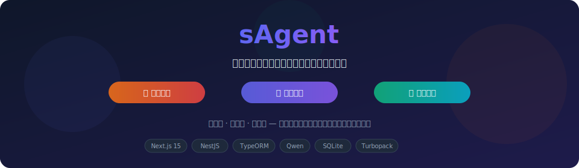
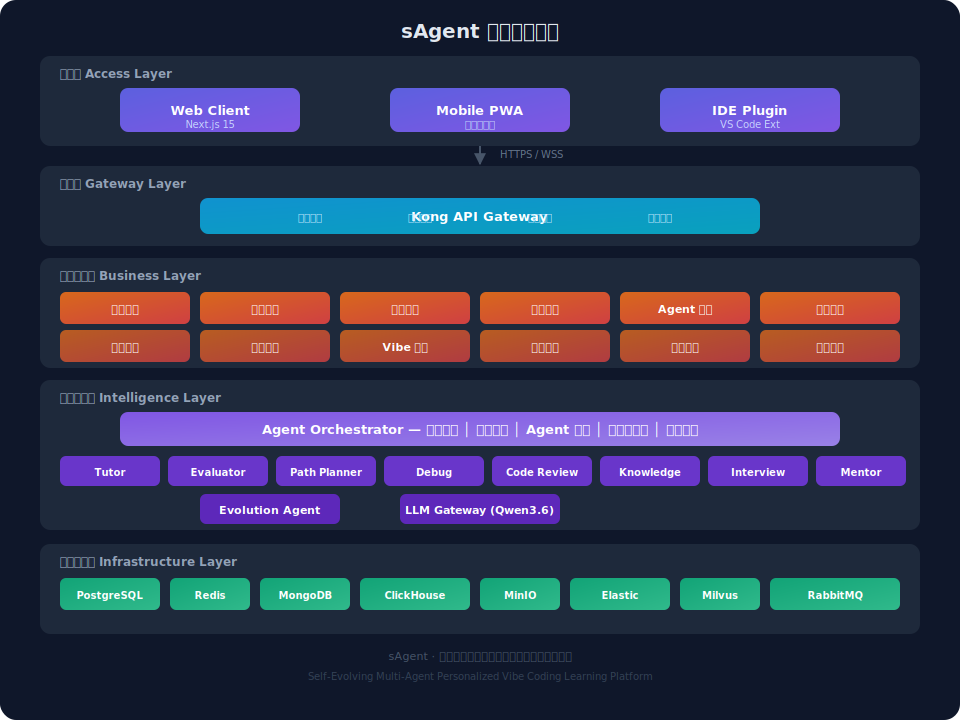
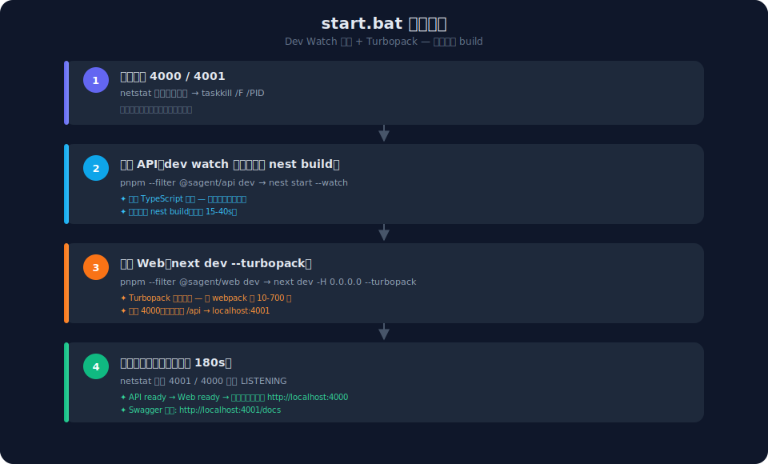
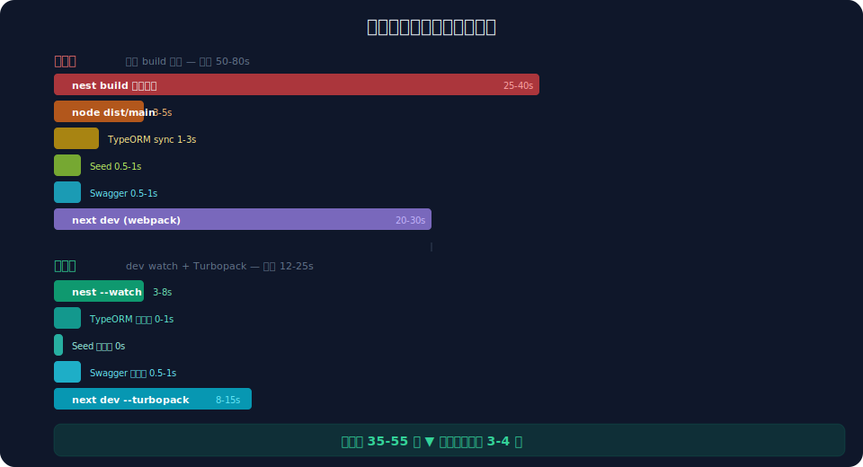

# sAgent · 自我进化多智能体个性化学习氛围编程平台

> 让每个人都能获得世界级的个性化编程教育 —— 通过多智能体协作、自我进化引擎与「氛围编程（Vibe Coding）」范式，把"学编程"从被动刷题变成"说意图、定氛围、控结果"的沉浸式编码体验。

<p align="center">
  
</p>

---

## 目录

- [1. 项目定位](#1-项目定位)
- [2. 核心特性](#2-核心特性)
- [3. 系统架构](#3-系统架构)
- [4. 多智能体协作](#4-多智能体协作)
- [5. 氛围编程学习体系](#5-氛围编程学习体系)
- [6. 技术栈](#6-技术栈)
- [7. 仓库结构](#7-仓库结构)
- [8. 快速开始](#8-快速开始)
- [9. 启动流程详解](#9-启动流程详解)
- [10. 性能优化记录](#10-性能优化记录)
- [11. 环境变量](#11-环境变量)
- [12. 测试与质量](#12-测试与质量)
- [13. 部署](#13-部署)
- [14. 路线图](#14-路线图)
- [15. 贡献指南](#15-贡献指南)
- [16. 许可证](#16-许可证)

---

## 1. 项目定位

| 维度 | 定位 |
|------|------|
| **一句话定位** | 全球领先的自我进化 AI 驱动氛围编程学习平台 |
| **市场领域** | 在线编程教育 / EdTech / AI+教育 |
| **目标市场** | 中国市场为主，辐射亚太，预留全球化能力 |
| **核心差异化** | 自我进化多智能体 + 氛围编程实时编码 + 深度个性化 |
| **价格定位** | Freemium 模式（基础免费 + 高级订阅） |

---

## 2. 核心特性

### 2.1 自我进化多智能体系统

平台的核心智能引擎，具备三个特征：

- **多智能体协作**：多个专业化 Agent 协同工作，覆盖学习全链路
- **自我进化**：系统基于用户反馈和学习效果数据，持续优化 Agent 策略与行为
- **自适应调整**：根据用户状态实时调整辅导策略和交互方式

### 2.2 氛围编程（Vibe Coding）范式

氛围编程是一种以「说意图、定氛围、控结果」为核心的编程范式，用户通过自然语言描述意图和氛围，借助 AI 生成代码并掌控最终产出。与传统编程不同，Vibe Coding 的核心能力在于**意图表达、氛围抽象、AI 协作与结果评审**，而非逐行手写代码。

**Vibe Coding 知识模块全景**：

```
认知思维 → 工具链 → 提示词工程 → 极简代码阅读 → 全栈工程能力 → AI 高级应用 → 质量安全 → 实战项目
```

### 2.3 个性化学习路径

采用 **贝叶斯知识追踪 (BKT)** + **强化学习 (RL)** 混合算法：

1. **BKT 层**：基于用户答题数据，估算每个知识点的掌握概率 P(known)
2. **RL 层**：基于历史学习效果数据，优化知识点推荐序列
3. **约束层**：应用知识图谱的前置依赖约束

### 2.4 实时编码与评测

- Monaco Editor 在线编码（VS Code 同引擎）
- Docker + gVisor 安全沙箱代码执行
- 自动评测（正确性 + 风格 + 安全 + 性能）
- AI 评估报告（Evaluator Agent）

---

## 3. 系统架构

### 3.1 分层架构

<p align="center">
  
</p>

### 3.2 数据流转路径

| 数据流 | 路径 | 协议 | 延迟目标 |
|--------|------|------|----------|
| 用户请求 → 业务响应 | Client → Gateway → Service → DB → Response | HTTPS | ≤ 200ms |
| 代码执行 | Client → Gateway → Exercise → Executor → Sandbox → Result | HTTPS | ≤ 3s |
| AI 对话 | Client → Gateway → Agent → LLM → Stream → Client | WSS + SSE | TTFT ≤ 2s |
| 行为采集 | Client → SDK → Kafka → Flink → ClickHouse | Kafka | ≤ 1s |
| 进化反馈 | ClickHouse → Evolution → Agent Config → Agent | HTTP | 分钟级 |

---

## 4. 多智能体协作

### 4.1 智能体分层架构

<p align="center">
  
</p>


### 4.2 智能体详细定义

| Agent | 层级 | 职责边界 | 触发场景 |
|-------|------|----------|----------|
| **Orchestrator** | L1 | 全局编排，不做业务逻辑 | 每次用户交互 |
| **Tutor** | L2 | 知识讲解与学习引导 | 用户提问、概念不理解 |
| **Evaluator** | L2 | 代码质量评估 | 用户提交代码 |
| **Path Planner** | L2 | 学习路径规划与调整 | 新用户注册、阶段评估 |
| **Debug** | L2 | 调试辅助与错误教学 | 运行错误、逻辑错误 |
| **Code Review** | L2 | 代码审查与优化 | 代码提交、项目评审 |
| **Knowledge Graph** | L2 | 知识图谱管理 | 路径规划、概念查询 |
| **Interview** | L2 | 面试模拟与准备 | 面试准备模式 |
| **Mentor** | L2 | 学习策略与动机管理 | 学习停滞、目标设定 |
| **Evolution** | L0 | 系统自我进化 | 定期触发 + 阈值触发 |

### 4.3 协作模式

| 协作模式 | 描述 | 适用场景 |
|----------|------|----------|
| **串行协作** | Agent 按序执行，前一个输出作为后一个输入 | 有明确依赖关系的任务 |
| **并行协作** | 多个 Agent 同时执行，结果由 Orchestrator 聚合 | 独立子任务 |
| **条件协作** | 根据条件动态选择协作路径 | 需要判断的场景 |
| **递归协作** | Agent 可调用其他 Agent 完成子任务 | 复杂任务分解 |

---

## 5. 氛围编程学习体系

### 5.1 八大知识模块

<p align="center">
  
</p>

| 模块 | 内容 | 核心目标 |
|------|------|----------|
| **认知与思维** | Vibe Coding 范式理解、角色转变、氛围抽象 | 完成角色认知转换 |
| **工具链** | AI IDE、Git、云平台部署 | 搭建 AI 开发环境 |
| **提示词工程** | 基础 Prompt 结构、氛围 Prompt、高级技巧 | 掌握 Prompt 编写方法 |
| **代码阅读与极简编程** | 前端基础、后端基础、代码评审能力 | 能读、能改、能调 |
| **全栈工程能力** | 需求拆解、架构选型、数据库设计、API 开发 | 能交付完整产品 |
| **AI 大模型与高级能力** | LLM 原理、RAG、AI Agent 开发 | 能构建 AI 应用 |
| **质量、安全与避坑** | AI 代码评审清单、幻觉识别、安全漏洞防范 | 不翻车的关键 |
| **实战项目** | 入门级、中级、高级项目 | 学完必须做 |

### 5.2 内容层次结构


### 5.3 难度分级标准

| 等级 | 名称 | 描述 | 题目特征 |
|------|------|------|----------|
| D1 | 入门 | 概念认知与基本操作 | 单知识点、有模板 Prompt、详细提示 |
| D2 | 简单 | 基础应用与简单组合 | 1-2 个知识点、少量提示 |
| D3 | 中等 | 综合应用与问题解决 | 2-3 个知识点、需独立分析 |
| D4 | 困难 | 复杂问题与优化方案 | 多知识点、多种解法、需优化 |
| D5 | 专家 | 创新解决与系统设计 | 开放性、系统级、需创新 |

---

## 6. 技术栈

### 6.1 前端

| 技术领域 | 方案 | 选型依据 |
|----------|------|----------|
| **框架** | Next.js 15 (App Router) + React 19 | SSR/SSG、React 生态、Turbopack |
| **UI 库** | Tailwind CSS 3 + lucide-react | 无障碍优先、高度可定制 |
| **状态管理** | Zustand + TanStack React Query | 轻量、服务端/客户端分离 |
| **代码编辑器** | Monaco Editor (via `@monaco-editor/react`) | VS Code 同引擎、生态丰富 |
| **实时通信** | Socket.IO Client | 自动重连、房间、降级 |
| **构建** | Turbopack (dev) + Webpack (build) | 比 webpack 快 10-700 倍 |

### 6.2 后端

| 技术领域 | 方案 | 选型依据 |
|----------|------|----------|
| **框架** | NestJS 10 (Node.js 20+) | TS 全栈统一、模块化、装饰器驱动 |
| **API 协议** | REST + WebSocket + SSE | 灵活性、兼容性 |
| **ORM** | TypeORM 0.3 | 装饰器实体、迁移、Repository 模式 |
| **数据库** | better-sqlite3 (开发) / PostgreSQL 16 (生产) | 嵌入式零配置 / 功能丰富 |
| **缓存** | cache-manager + ioredis | 多级缓存、Redis 集群支持 |
| **认证** | Passport + JWT (Access + Refresh) | 策略模式、refresh token |
| **限流** | @nestjs/throttler (三窗口) | 短/中/长窗口限流 |
| **文档** | Swagger / OpenAPI (`/docs`) | 自动 API 文档生成 |

### 6.3 AI 引擎

| 技术领域 | 方案 | 选型依据 |
|----------|------|----------|
| **主 LLM** | 讯飞星火 Qwen3.6-35B-A3B-xf | 已有 API、OpenAI 兼容 |
| **LLM 客户端** | openai SDK (v4) | 流式响应、token 管理 |
| **代码分析** | Tree-sitter + LSP | 多语言、增量解析 |
| **RAG 框架** | LangChain.js | 生态丰富、JS 原生 |

### 6.4 DevOps

| 技术领域 | 方案 |
|----------|------|
| **包管理** | pnpm 9+ workspaces (monorepo) |
| **容器编排** | Docker + docker-compose (开发) / Kubernetes (生产) |
| **CI/CD** | GitHub Actions |
| **监控** | Prometheus + Grafana |
| **日志** | ELK Stack |
| **链路追踪** | OpenTelemetry + Jaeger |

---

## 7. 仓库结构

```
sagent/
├── apps/                          # 应用层（pnpm workspaces）
│   ├── api/                       # NestJS 后端 API
│   │   ├── src/
│   │   │   ├── main.ts            # 应用入口（bootstrap）
│   │   │   ├── app.module.ts      # 根模块（聚合 20+ 业务模块）
│   │   │   ├── common/            # 全局拦截器、过滤器、守卫、WebSocket 网关
│   │   │   ├── database/          # TypeORM 数据库模块
│   │   │   ├── entities/          # TypeORM 实体（20+ 张表）
│   │   │   └── modules/           # 业务模块
│   │   │       ├── agent/         # Agent 编排、预览、进化
│   │   │       ├── ai-session/    # AI 会话管理
│   │   │       ├── analytics/     # 学习行为分析
│   │   │       ├── assessment/    # 能力诊断评估
│   │   │       ├── auth/          # 认证授权（JWT + Passport）
│   │   │       ├── badge/         # 徽章成就系统
│   │   │       ├── bookmark/      # 收藏功能
│   │   │       ├── community/     # 社区讨论
│   │   │       ├── exercise/      # 练习题与提交
│   │   │       ├── health/        # 健康检查
│   │   │       ├── history/       # 学习历史
│   │   │       ├── knowledge-point/ # 知识点 + 知识图谱 + Seed
│   │   │       ├── learning-path/ # 学习路径规划
│   │   │       ├── sandbox/       # 代码执行沙箱
│   │   │       ├── user/          # 用户管理
│   │   │       └── vibe-learning/ # 氛围编程学习模块
│   │   ├── data/sagent.db         # SQLite 数据库文件（开发环境）
│   │   ├── nest-cli.json
│   │   ├── tsconfig.json
│   │   ├── Dockerfile
│   │   └── package.json           # @sagent/api
│   │
│   └── web/                       # Next.js 15 前端
│       ├── src/
│       │   ├── app/               # App Router 页面
│       │   │   ├── layout.tsx     # 根布局
│       │   │   ├── page.tsx       # 首页
│       │   │   ├── assessment/    # 能力诊断
│       │   │   ├── dashboard/     # 主控台
│       │   │   │   ├── analytics/      # 数据分析
│       │   │   │   ├── api-playground/ # API 试验场
│       │   │   │   ├── badges/         # 成就徽章
│       │   │   │   ├── bookmarks/      # 收藏
│       │   │   │   ├── challenges/     # 挑战
│       │   │   │   ├── chat/           # AI 对话
│       │   │   │   ├── codelab/        # 代码实验室
│       │   │   │   ├── community/      # 社区
│       │   │   │   ├── datasets/       # 数据集
│       │   │   │   ├── evolution/      # 进化引擎
│       │   │   │   ├── exercises/      # 练习
│       │   │   │   ├── history/        # 历史
│       │   │   │   ├── interview/      # 面试模拟
│       │   │   │   ├── knowledge/      # 知识图谱
│       │   │   │   ├── learn/          # 学习路径
│       │   │   │   ├── projects/       # 项目实战
│       │   │   │   ├── research/       # 研究
│       │   │   │   ├── settings/       # 设置
│       │   │   │   └── vibe/           # 氛围编程
│       │   │   │       └── detail/     # 100+ 知识点详情页
│       │   │   ├── login/
│       │   │   ├── onboarding/
│       │   │   ├── register/
│       │   │   └── test-iframe/
│       │   ├── components/        # 组件
│       │   │   ├── learn/         # 学习相关组件
│       │   │   └── vibe/          # 氛围编程组件
│       │   ├── hooks/
│       │   ├── lib/
│       │   └── stores/
│       ├── public/
│       ├── next.config.js
│       ├── tailwind.config.js
│       ├── Dockerfile
│       └── package.json           # @sagent/web
│
├── packages/
│   └── shared/                    # 跨应用共享类型与工具
│       ├── src/
│       │   ├── agent.ts
│       │   ├── api.ts
│       │   ├── error-codes.ts
│       │   ├── response.ts
│       │   ├── types.ts
│       │   └── index.ts
│       └── package.json           # @sagent/shared
│
├── doc/                           # 项目文档
│   ├── requirements.md            # 需求分析文档（主文档）
│   ├── digr/                      # SVG 架构图与流程图
│   │   ├── 01-进化总体流程图.svg
│   │   ├── 02-进化前后对比.svg
│   │   ├── 03-策略效果对比.svg
│   │   ├── 04-A-B测试流程.svg
│   │   ├── 05-学生成绩进步图.svg
│   │   └── 06-Prompt进化对比.svg
│   ├── svg/                       # 氛围编程 SVG 设计稿
│   ├── coding-guidelines.md
│   └── ...
│
├── pnpm-workspace.yaml            # pnpm workspace 配置
├── package.json                   # 根 package.json
├── docker-compose.yml             # Docker Compose 编排
├── start.bat                      # Windows 快速启动脚本
├── run.bat                        # Windows 备用启动脚本
└── README.md                      # 本文档
```

---

## 8. 快速开始

### 8.1 环境要求

| 依赖 | 版本要求 | 用途 |
|------|----------|------|
| Node.js | ≥ 20.x LTS | 前后端运行时 |
| pnpm | ≥ 9.0.0 | 包管理（monorepo） |
| Docker | ≥ 24.x（可选） | 代码沙箱、容器化部署 |
| Git | ≥ 2.40 | 版本控制 |

### 8.2 安装

```bash
# 1. 克隆仓库
git clone <repo-url> sagent
cd sagent

# 2. 安装依赖（pnpm 会自动处理 workspace）
pnpm install

# 3. 配置环境变量
cp apps/api/.env.example apps/api/.env
# 编辑 apps/api/.env 填入 LLM_API_KEY 等
```

### 8.3 启动

**Windows 用户**（推荐）：

```bat
:: 一键启动（dev watch 模式 + Turbopack）
start.bat
```

**跨平台手动启动**：

```bash
# 同时启动 API 和 Web（dev watch 模式）
pnpm dev

# 或分别启动
pnpm --filter @sagent/api dev    # API: http://localhost:4001/api/v1
pnpm --filter @sagent/web dev    # Web: http://localhost:4000
```

### 8.4 访问

| 服务 | 地址 |
|------|------|
| Web 前端 | http://localhost:4000 |
| API 后端 | http://localhost:4001/api/v1 |
| Swagger 文档 | http://localhost:4001/docs |

---

## 9. 启动流程详解

### 9.1 `start.bat` 启动流程

<p align="center">
  
</p>

### 9.2 dev watch 模式 vs 传统 build 模式

| 维度 | 传统模式（已废弃） | dev watch 模式（当前） |
|------|-------------------|----------------------|
| **启动命令** | `nest build && node dist/main.js` | `nest start --watch` |
| **编译方式** | 全量 tsc 编译 | 增量编译 + 文件监听 |
| **首次启动** | 15-40s（含 build） | 3-8s（跳过 build） |
| **改代码后** | 手动重新 build + 重启 | 自动增量编译 + 热重启 |
| **Web 构建** | webpack（慢） | Turbopack（快 10-700 倍） |
| **Swagger** | 启动时同步生成 | 仅非生产环境挂载 |
| **TypeORM** | `synchronize: true` 每次扫表 | 仅首次启动（无 DB 文件）才同步 |

### 9.3 端口分配

| 服务 | 端口 | 说明 |
|------|------|------|
| Web 前端 | 4000 | Next.js dev server |
| API 后端 | 4001 | NestJS API server |
| Swagger | 4001/docs | 与 API 共享端口 |

---

## 10. 性能优化记录

本项目经历了一轮系统性的启动性能优化，以下是优化前后对比：

### 10.1 优化项总览

| 优化项 | 优化前 | 优化后 | 预计收益 |
|--------|--------|--------|----------|
| **启动脚本** | `nest build` 全量编译 + `node dist/main.js` | `pnpm --filter dev` watch 模式 + Turbopack | 15-40s |
| **TypeORM synchronize** | `synchronize: true` 每次启动扫 20+ 实体 DDL | 仅首次启动（无 DB 文件）才同步 | 1-3s |
| **KnowledgeSeedService** | `OnApplicationBootstrap` 启动时同步阻塞 seed（含两次 `buildAllKnowledgePoints()` 浪费） | `OnModuleInit` 仅 count 检查，懒 seed（首次查询时才写入） | 启动时省掉 seed 写入 |
| **Swagger 文档生成** | 启动时同步扫描所有路由生成 OpenAPI | 仅非生产环境挂载，生产环境跳过 | 生产启动省几百 ms 到数秒 |

### 10.2 优化前后启动耗时对比

<p align="center">
  
</p>

### 10.3 仍可进一步优化的点

1. **Web 端 Monaco Editor 首屏编译重** — 可改用 `next/dynamic` 懒加载 Monaco
2. **AppModule 一次性加载 20+ 模块** — 可考虑按需加载（但 NestJS 不太友好）
3. **better-sqlite3 启动时会做 WAL/checkpoint** — 可改 `PRAGMA journal_mode=MEMORY`

---

## 11. 环境变量

### 11.1 API 环境变量（`apps/api/.env`）

```bash
# ===== 应用 =====
NODE_ENV=development          # development | production | test
PORT=4001                     # API 服务端口
CORS_ORIGIN=http://localhost:4000  # 前端地址（CORS 白名单）
FRONTEND_URL=http://localhost:4000 # 前端 URL（用于邮件链接）

# ===== JWT =====
JWT_SECRET=sagent-dev-secret          # Access Token 签名密钥（生产环境务必更换）
JWT_REFRESH_SECRET=sagent-refresh-secret  # Refresh Token 签名密钥（生产环境务必更换）

# ----- LLM 讯飞星火 -----
LLM_API_KEY=                   # 讯飞星火 API Key
LLM_BASE_URL=https://maas-api.cn-huabei-1.xf-yun.com/v2  # LLM API Base URL

# ----- GitHub OAuth（可选） -----
GITHUB_CLIENT_ID=              # GitHub OAuth App Client ID
GITHUB_CLIENT_SECRET=          # GitHub OAuth App Client Secret

# ----- 代码沙箱 -----
SANDBOX_MODE=auto              # auto | docker | process（auto 优先 Docker，回退进程）
SANDBOX_DOCKER_IMAGE=node:18-alpine  # Docker 沙箱镜像
SANDBOX_TIMEOUT_MS=10000       # 沙箱执行超时（毫秒）
SANDBOX_MAX_MEMORY_KB=262144   # 沙箱内存限制（KB，默认 256MB）
SANDBOX_TEMP_DIR=              # 沙箱临时目录（默认系统临时目录）
```

### 11.2 Web 环境变量（`apps/web/.env.local`）

```bash
NEXT_PUBLIC_API_URL=http://localhost:4001/api/v1  # API 地址
```

---

## 12. 测试与质量

### 12.1 测试命令

```bash
# 运行所有包的测试
pnpm test

# 运行 API 测试
pnpm --filter @sagent/api test

# 类型检查
pnpm typecheck

# 代码风格检查
pnpm lint
```

### 12.2 质量保证计划

| 质量活动 | 频率 | 参与者 | 产出 |
|----------|------|--------|------|
| 代码审查 | 每个 PR | 开发者 + 技术负责人 | 审查通过 |
| 单元测试 | 每次提交 | CI 自动 | 覆盖率 ≥ 80% |
| 集成测试 | 每日 | CI 自动 | 核心流程通过 |
| E2E 测试 | 每周 | QA | 关键路径通过 |
| 性能测试 | 每阶段 | DevOps | 性能报告 |
| 安全扫描 | 每阶段 | DevOps | 安全报告 |

---

## 13. 部署

### 13.1 Docker Compose 部署（开发/测试）

```bash
# 构建并启动所有服务
docker-compose up -d

# 查看日志
docker-compose logs -f

# 停止
docker-compose down
```

### 13.2 Kubernetes 部署（生产）

```bash
# 应用 Kubernetes 配置
kubectl apply -f k8s/

# 查看部署状态
kubectl get pods
```

### 13.3 容灾备份策略

| 策略 | 实施方案 | RPO | RTO |
|------|----------|-----|-----|
| **数据备份** | 每日增量 + 每周全量，异地存储 | ≤ 24h | ≤ 4h |
| **多可用区** | 同区域双 AZ 部署 | 0 | ≤ 30s |
| **故障转移** | 自动健康检查 + 故障转移 | 0 | ≤ 60s |
| **灾备演练** | 季度灾备演练 | - | - |

---

## 14. 路线图

---

## 15. 贡献指南

我们欢迎所有形式的贡献！

### 15.1 贡献流程

1. **Fork** 本仓库
2. **创建**特性分支：`git checkout -b feature/amazing-feature`
3. **提交**更改：`git commit -m 'Add amazing feature'`
4. **推送**到分支：`git push origin feature/amazing-feature`
5. **提交** Pull Request

### 15.2 代码规范

- **TypeScript**：严格模式，所有代码必须通过 `tsc --noEmit` 检查
- **ESLint + Prettier**：统一代码风格
- **提交信息**：遵循 [Conventional Commits](https://www.conventionalcommits.org/)
  - `feat:` 新功能
  - `fix:` Bug 修复
  - `docs:` 文档更新
  - `refactor:` 代码重构
  - `perf:` 性能优化
  - `test:` 测试相关
  - `chore:` 构建/工具变更

### 15.3 分支策略

| 分支 | 用途 | 命名规范 |
|------|------|----------|
| `main` | 生产稳定分支 | - |
| `develop` | 开发集成分支 | - |
| `feature/*` | 功能开发分支 | `feature/vibe-coding-lab` |
| `fix/*` | Bug 修复分支 | `fix/login-redirect` |
| `release/*` | 发布分支 | `release/v1.0.0` |

---

## 16. 许可证

本项目采用 MIT 许可证 - 详见 [LICENSE](LICENSE) 文件

---

## 附录

### A. 术语表

| 术语 | 英文 | 定义 |
|------|------|------|
| Agent | Intelligent Agent | 智能代理，具有特定角色和能力的 AI 实体 |
| ACP | Agent Communication Protocol | 智能体通信协议 |
| BKT | Bayesian Knowledge Tracing | 贝叶斯知识追踪，用于估算知识掌握概率 |
| DAG | Directed Acyclic Graph | 有向无环图，用于表示学习路径的知识依赖关系 |
| IRT | Item Response Theory | 项目反应理论，用于自适应测试 |
| LLM | Large Language Model | 大语言模型 |
| RAG | Retrieval-Augmented Generation | 检索增强生成 |
| RL | Reinforcement Learning | 强化学习 |
| TTFT | Time To First Token | 首字延迟 |
| gVisor | - | Google 开源的容器沙箱运行时 |
| PWA | Progressive Web App | 渐进式 Web 应用 |
| NPS | Net Promoter Score | 净推荐值 |
| CSAT | Customer Satisfaction Score | 客户满意度 |
| SM-2 | SuperMemo 2 | 间隔重复算法 |
| RPO | Recovery Point Objective | 恢复点目标 |
| RTO | Recovery Time Objective | 恢复时间目标 |
| LOC | Lines of Code | 代码行数 |
| SMART | Specific, Measurable, Achievable, Relevant, Time-bound | 需求原则 |
| MoSCoW | Must, Should, Could, Won't | 需求优先级方法 |

### B. 技术约束与兼容性要求

#### B.3 浏览器兼容性

| 浏览器 | 支持版本 | 备注 |
|--------|----------|------|
| Chrome | 最新 2 个主要版本 | 主要支持 |
| Firefox | 最新 2 个主要版本 | 主要支持 |
| Safari | 最新 2 个主要版本 | 主要支持 |
| Edge | 最新 2 个主要版本 | 主要支持 |
| IE | 不支持 | - |
| 移动端 Chrome/Safari | 最新版本 | 响应式适配 |

---

<p align="center">
  <strong>sAgent</strong> · 自我进化多智能体个性化学习氛围编程平台<br/>
  让每个人都能获得世界级的个性化编程教育
</p>
