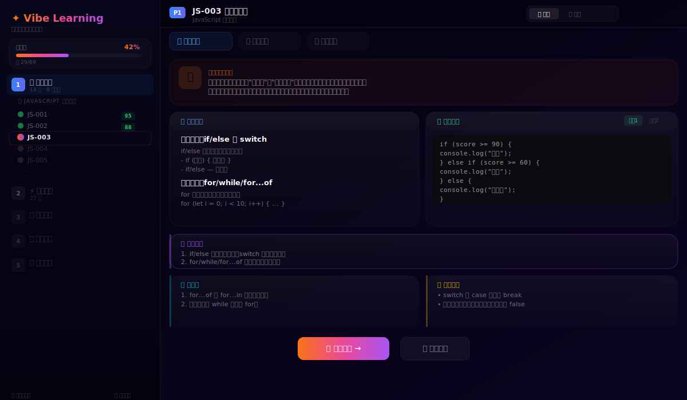
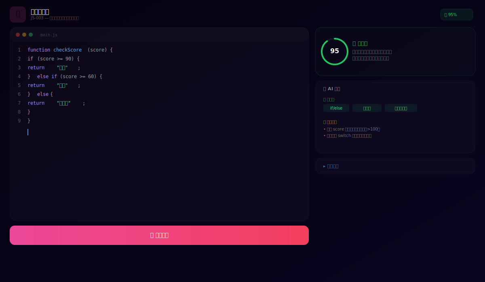
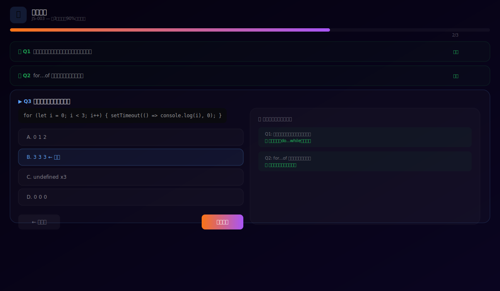
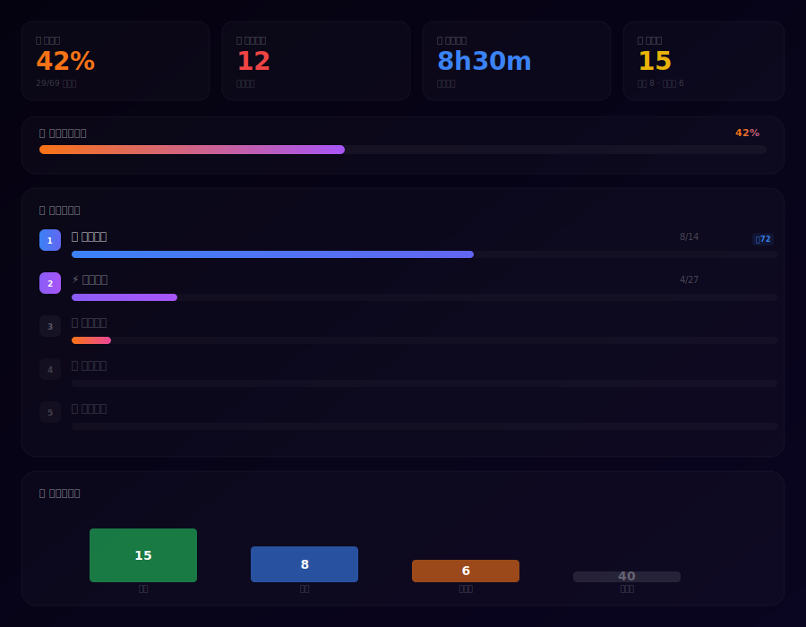

# 氛围学习（Vibe Learning）全面重新设计方案

> 版本：v2.0 | 日期：2025-06-15 | 状态：待实现
> 目标 URL：`http://localhost:4000/dashboard/vibe`

---

## 目录

1. [问题诊断](#1-问题诊断)
2. [教学结构规划](#2-教学结构规划)
3. [教学内容呈现](#3-教学内容呈现)
4. [教学体验优化](#4-教学体验优化)
5. [界面设计稿（SVG）](#5-界面设计稿svg)
6. [交互流程说明](#6-交互流程说明)
7. [技术实现路径](#7-技术实现路径)
8. [质量标准与验收](#8-质量标准与验收)

---

## 1. 问题诊断

### 1.1 原始问题清单

| # | 问题类别 | 严重程度 | 具体描述 |
|---|---------|---------|---------|
| 1 | 教学结构 | 🔴 严重 | 未体现"分阶段教学"原则，所有知识点平铺罗列，无递进层次 |
| 2 | 教学结构 | 🔴 严重 | 未实现"分知识点讲解"功能，用户无法选择或跳转特定知识点 |
| 3 | 内容呈现 | 🔴 严重 | 教学内容仅以简单文本罗列方式呈现，无概念→示例→练习→评估的闭环 |
| 4 | 内容呈现 | 🟡 中等 | 缺乏具体的编程示例和代码编辑区，纯理论罗列 |
| 5 | 教学体验 | 🟡 中等 | 无沉浸式学习环境，界面风格与"氛围编程"主题不符 |
| 6 | 教学体验 | 🟡 中等 | 无学习路径指引，无进度跟踪，无难度自适应 |
| 7 | 教学质量 | 🔴 严重 | 不符合认知规律（由浅入深、循序渐进），无掌握评估标准 |

### 1.2 根因分析

原始实现为单页面全量渲染模式：

- `page.tsx` 将所有逻辑耦合在一个文件中，侧边栏、阅读面板、测验面板、编码面板混为一体
- 无阶段划分配置，知识点以扁平数组传递，未利用后端 `learning-path.engine.ts` 的拓扑排序能力
- 后端 `adaptive-learning.engine.ts` 有 BKT + IRT 自适应算法，但前端未体现
- 后端已为全部 69 个知识点提供完整的结构化讲授内容（`lecture-content.data.ts`，3357行），包含 motivation、concepts、codeExamples、summary、tips、thinkQuestions，但前端仅做文本罗列

---

## 2. 教学结构规划

### 2.1 五阶段教学体系

将 69 个知识点划分为 **5 个逻辑递进的学习阶段**，严格遵循认知规律：

```
阶段1: 基础夯实 ──→ 阶段2: 进阶突破 ──→ 阶段3: 框架实战 ──→ 阶段4: 工程规范 ──→ 阶段5: 精通掌握
  (14讲)              (27讲)              (18讲)              (9讲)               (21讲)
```

| 阶段 | ID | 名称 | 讲数 | 学习目标 | 前置知识要求 | 阶段成果 |
|------|-----|------|------|---------|------------|---------|
| P1 | `foundation` | 🧱 基础夯实 | 14 | 掌握 JavaScript 语言核心 | 无（零基础可学） | 能独立编写 JS 函数和数据处理逻辑 |
| P2 | `advancement` | ⚡ 进阶突破 | 27 | 掌握服务端开发与前端核心技能 | P1 全部知识点 | 能搭建 Node.js 服务 + 编写前端页面 |
| P3 | `framework` | 🏗️ 框架实战 | 18 | 学习 React 核心概念与实战技巧 | P2 服务端 + 前端基础 | 能开发完整的 React 单页应用 |
| P4 | `engineering` | 🔧 工程规范 | 9 | 掌握工程化工具链与部署实践 | P3 React 实战能力 | 能将项目工程化并部署上线 |
| P5 | `mastery` | 🎓 精通掌握 | 21 | AI 辅助开发与综合实战 | P4 工程化能力 | 成为全栈 Vibe Coder |

### 2.2 模块化拆分

每个阶段内部按模块拆分，确保单一知识点聚焦性强：

```
P1 基础夯实
└── 📜 JavaScript 核心基础 (14 讲)
    ├── JS-001 变量与数据类型
    ├── JS-002 运算符与表达式
    ├── JS-003 条件与循环
    ├── JS-004 函数基础
    ├── JS-005 数组方法
    ├── JS-006 字符串与模板字面量
    ├── JS-007 解构与展开
    ├── JS-008 对象与原型链
    ├── JS-009 类与面向对象
    ├── JS-010 异步编程基础
    ├── JS-011 Promise 与 async/await
    ├── JS-012 错误处理
    ├── JS-013 模块化
    └── JS-014 迭代器与生成器

P2 进阶突破
├── 🟢 Node.js 服务端开发 (19 讲)
│   ├── NODE-001 ~ NODE-019
└── 🎨 前端三件套 (8 讲)
    ├── FE-001 ~ FE-008

P3 框架实战
└── ⚛️ React 基础 (18 讲)
    ├── REACT-001 ~ REACT-018

P4 工程规范
└── 📦 工程化与部署 (3 讲)
    ├── ENG-001 ~ ENG-003

P5 精通掌握
└── 🤖 AI + 现代开发 (3 讲)
    ├── AI-001 ~ AI-003
```

### 2.3 知识点依赖图（关键路径）

```
JS-001 ─→ JS-002 ─→ JS-003 ─→ JS-004 ─┬─→ JS-005
   │                                     └─→ JS-008 ─→ JS-009
   └─→ JS-006 ─→ JS-007
                                    JS-010 ─→ JS-011
JS-004 + JS-005 ─→ NODE-001 ─→ NODE-002 ─→ ...
FE-* + NODE-* ─→ REACT-001 ─→ REACT-002 ─→ ...
REACT-* ─→ ENG-001 ─→ ...
ENG-* ─→ AI-001 ─→ ...
```

> 完整依赖图由后端 `learning-path.engine.ts` 基于拓扑排序（Kahn's Algorithm）动态生成。

---

## 3. 教学内容呈现

### 3.1 教学闭环：概念讲解 → 示例演示 → 实践练习 → 反馈评估

每个知识点的学习遵循 **四步闭环**：

```
┌──────────────────────────────────────────────────┐
│                  单个知识点学习闭环                  │
│                                                    │
│  📖 概念理解  ──→  💻 动手实践  ──→  📝 评估反馈   │
│  (ConceptPanel)  (VibeCodeLab)   (VibeQuizPanel)  │
│                                                    │
│       ↑                                     │      │
│       └────── 未通过？返回重新学习 ──────────────┘      │
└──────────────────────────────────────────────────┘
```

#### 步骤1：概念理解（ConceptPanel）

| 区块 | 内容 | 设计意图 |
|------|------|---------|
| 🌟 动机引入 | "为什么学这个？" — 用1-2句话说明该知识点的实际应用场景 | 激发学习动机，回答"学了有什么用" |
| 📚 核心概念 | 2-4 个概念卡片，每个包含标题 + 详细讲解 | 渐进深入：从简单到复杂 |
| 💻 代码示例 | 2-3 个带注释的代码示例，可切换 | 代码即教学，手把手教 |
| 📋 要点总结 | 4-6 条精炼总结 | 强化记忆 |
| 🤔 思考题 | 2-3 道启发性问题（不计分） | 引导深层理解 |
| 💡 学习贴士 | 3-5 条常见坑点和最佳实践 | 避免踩坑 |

#### 步骤2：动手实践（VibeCodeLab）

| 区块 | 内容 | 设计意图 |
|------|------|---------|
| Monaco 编辑器 | 预填代码模板，学生修改/补全 | 真实编码体验 |
| 提交评估 | AI 分析代码，给出分数 + 反馈 | 即时反馈 |
| 评分环 | 环形进度条显示得分 | 视觉化评估 |
| AI 分析标签 | 已实现 ✅ / 未实现 ❌ / 改进建议 💡 | 精准定位问题 |
| 参考答案 | 未通过时可展开查看 | 学习对照 |

#### 步骤3：评估反馈（VibeQuizPanel）

| 区块 | 内容 | 设计意图 |
|------|------|---------|
| 手风琴式答题 | 逐题展开，支持前后导航 | 专注当前题目 |
| 进度条 | 已答/总题数 + 百分比 | 进度感知 |
| 结果卡片 | 通过🎉/未通过💪 + 分数 + 评语 | 明确的评估结果 |
| 答题回顾 | 逐题显示正确/错误 + 正确答案 | 查漏补缺 |

#### 步骤4：闭环决策

```
评估通过（score ≥ 90%）──→ 🎉 完成动画 ──→ 推荐下一个知识点
评估未通过（score < 90%）──→ 💪 重试选项 ──→ 回到概念理解 或 直接重试
```

### 3.2 教学内容数据结构

每个知识点的讲授内容由后端 `lecture-content.data.ts` 提供，结构如下：

```typescript
interface LectureContent {
  nodeId: string;           // 知识点ID，如 "JS-001"
  motivation: string;       // "为什么学这个？"
  concepts: LectureConcept[];  // 核心概念（2-4个）
  codeExamples: CodeExample[]; // 代码示例（2-3个）
  summary: string;          // 要点总结
  tips: string[];           // 学习贴士（3-5条）
  thinkQuestions: string[]; // 思考题（2-3个）
}
```

> 当前已为全部 69 个知识点提供完整的结构化讲授内容，存储于 `apps/api/src/modules/vibe-learning/lecture-content.data.ts`（3357行）。

### 3.3 互动式学习元素

| 互动元素 | 实现方式 | 位置 |
|---------|---------|------|
| 代码编辑区 | Monaco Editor（VS Code 同款引擎） | VibeCodeLab |
| 实时评估 | AI 代码分析（正确/缺失/建议标签） | VibeCodeLab |
| 评分可视化 | SVG 环形进度条 | VibeCodeLab |
| 参考答案折叠 | 手风琴展开/收起 | VibeCodeLab |
| 选择题交互 | 单选按钮 + 即时高亮 | VibeQuizPanel |
| 答题进度 | 动态进度条 | VibeQuizPanel |
| AI 对话 | Chat 界面，可追问 | page.tsx chat 模式 |
| 知识点导航 | 侧边栏可点击切换 | VibeSidebar |
| 阶段解锁 | 灰色锁定状态，前置阶段完成后解锁 | VibeSidebar |
| 掌握度徽章 | 每个知识点旁显示掌握百分比 | VibeSidebar |

---

## 4. 教学体验优化

### 4.1 沉浸式学习环境

**设计主题**：深色氛围（Dark Vibe）— 以 `#050210` 为底色，搭配 Glass Morphism 效果

| 设计元素 | 具体实现 | 效果 |
|---------|---------|------|
| 深色背景 | `#050210` 主色 + `rgba(8,6,20,0.85)` 侧边栏 | 沉浸式暗色环境，减少视觉干扰 |
| Glass 效果 | `glass` CSS类 + `backdrop-blur` + 半透明边框 | 现代感毛玻璃质感 |
| 渐变色彩 | 每阶段独立渐变：蓝→紫→橙→绿→金 | 阶段辨识度 |
| 微动画 | `animate-fade-in` + `animate-pulse` + `transition-all` | 流畅的界面过渡 |
| 代码高亮 | Monaco Editor VS Dark 主题 + 等宽字体 | 专业编码体验 |
| 精细间距 | 统一使用 `rounded-2xl`、`px-5 py-3` 等设计令牌 | 视觉一致性 |

**色彩体系**：

```
P1 基础夯实:  from-blue-500 → to-indigo-500    (蓝色系 — 稳重基础)
P2 进阶突破:  from-violet-500 → to-purple-500  (紫色系 — 进阶能量)
P3 框架实战:  from-orange-500 → to-pink-500    (橙色系 — 实战热情)
P4 工程规范:  from-emerald-500 → to-teal-500   (绿色系 — 工程严谨)
P5 精通掌握:  from-amber-500 → to-yellow-500   (金色系 — 精通荣耀)
```

### 4.2 知识点间平滑过渡

**完成动画**：当知识点评估通过时，显示过渡卡片：

```
┌─────────────────────────────────────────────────┐
│  🎉 JS-001 变量与数据类型 已通过！                │
│     得分 95% · 下一讲：JS-002 运算符与表达式      │
│                                [继续学习 →]       │
└─────────────────────────────────────────────────┘
```

**侧边栏状态更新**：当前节点从脉冲圆点 → 绿色对勾，下一节点从锁定 → 可用

### 4.3 进度跟踪功能

**VibeProgressDashboard** 提供四层进度追踪：

| 层次 | 内容 | 呈现方式 |
|------|------|---------|
| 总进度 | 完成百分比 + 已完成/总数 | 渐变进度条 |
| 阶段进度 | 每阶段完成数/总数 + 均掌握度 | 5 条分色进度条 |
| 掌握度分布 | 精通/熟练/学习中/未开始 | 柱状图 |
| 统计卡片 | 学习天数、时长、精通数 | 4 个数据卡 |

### 4.4 难度自适应调整机制

系统已实现三级自适应引擎（后端 `adaptive-learning.engine.ts`）：

| 组件 | 算法 | 作用 |
|------|------|------|
| BKT（贝叶斯知识追踪） | 基于四参数模型追踪知识掌握度 | 评估"学生是否真正掌握了" |
| IRT（项目反应理论） | 基于 theta 能力值选择难度匹配的题目 | 个性化出题 |
| 节奏控制 | 基于学习速度和正确率调整推进节奏 | 避免过快或过慢 |

**学生画像分类**：

```
零基础新手 (beginner)   → 全量学习，不跳过任何知识点
有基础转行 (transition) → 智能跳过已掌握的基础知识
有经验提升 (advanced)   → 聚焦进阶和实战，跳过基础模块
```

**自适应决策逻辑**：

```
连续3次通过 ──→ 加速推进（跳过相似题目）
连续2次未通过 ──→ 降速强化（推荐回到概念理解）
掌握度 > 0.9 ──→ 标记为"精通"，可跳过
掌握度 < 0.6 ──→ 标记为"需强化"，推荐重学
```

---

## 5. 界面设计稿（SVG）

### 5.1 整体布局（主学习界面 — 概念理解模式）



> 侧边栏：5阶段导航 + 知识点列表 + 总进度条。主内容区：阶段徽章 + 知识点标题 + 模式切换栏 + 概念面板（动机卡片 → 核心概念卡 + 代码示例卡 → 要点总结 → 思考题 + 学习贴士 → CTA按钮）。

### 5.2 编码实验室（VibeCodeLab — 动手实践模式）



> 左侧：Monaco Editor（VS Dark主题 + 行号 + 语法高亮 + 光标闪烁）。右侧：评分环（SVG环形进度条）+ AI分析标签（已实现/改进建议）+ 参考答案折叠。底部：渐变提交按钮。

### 5.3 评估测验（VibeQuizPanel — 评估反馈模式）



> 顶部：渐变进度条（已答2/3）。已答题：绿色边框卡片 + 答对标记。当前题：蓝色边框展开卡片 + 代码题干 + 4个选项（选中项高亮）+ 导航按钮。右侧：答题回顾面板。

### 5.4 进度仪表盘（VibeProgressDashboard）



> 4个统计卡片（总进度42% / 学习天数12 / 学习时长8h30m / 精通数15）+ 总体进度条 + 分阶段进度（5条分色进度条）+ 掌握度分布柱状图（精通15 / 熟练8 / 学习中6 / 未开始40）。

---

## 6. 交互流程说明

### 6.1 核心用户旅程

```
用户访问 /dashboard/vibe
       │
       ▼
┌─────────────────┐
│  加载学习环境    │ ← 调用 POST /vibe-learning/start
│  (Loading动画)   │    获取 sessionId + nextStep
└────────┬────────┘
        │
        ▼
┌─────────────────────────────────┐
│         主学习界面               │
│  ┌──────────┐ ┌──────────────┐  │
│  │  侧边栏  │ │   主内容区    │  │
│  │  阶段导航 │ │  模式切换栏   │  │
│  │  知识点   │ │  活动面板     │  │
│  │  进度条   │ │  操作按钮     │  │
│  └──────────┘ └──────────────┘  │
└─────────────────────────────────┘
```

### 6.2 学习闭环交互流

```
                    ┌──────────────────┐
                    │  选择知识点(侧边栏) │
                    └────────┬─────────┘
                             │
                             ▼
                    ┌──────────────────┐
             ┌──────│  📖 概念理解模式   │──────┐
             │      └──────────────────┘      │
             │  用户阅读动机、概念、示例      │
             │  点击"开始实践"               │
             ▼                                │
    ┌──────────────────┐                     │
    │  💻 动手实践模式   │                     │
    └────────┬─────────┘                     │
             │  用户在编辑器中编写代码        │
             │  点击"提交代码"               │
             ▼                                │
    ┌──────────────────┐                     │
    │  AI 评估 + 反馈   │                     │
    └────────┬─────────┘                     │
             │                                │
    ┌────────┴────────┐                      │
    │                  │                      │
 通过(≥90%)       未通过(<90%)               │
    │                  │                      │
    ▼                  ▼                      │
┌──────────┐   ┌──────────────────┐          │
│ 📝 评估   │   │ 💪 建议回到概念理解 │──────────┘
│  测验模式 │   └──────────────────┘
└────┬─────┘
    │  完成全部测验题
    ▼
┌────────────────────┐
│  评估结果           │
│  通过 → 🎉 下一知识点 │
│  未通过 → 💪 重试    │
└────────────────────┘
```

### 6.3 侧边栏交互

```
点击阶段标题 ──→ 展开/收起该阶段知识点列表
点击知识点   ──→ 切换到该知识点的概念理解模式
已完成节点   ──→ 绿色对勾 + 灰色文字 + 掌握度徽章
当前节点     ──→ 渐变脉冲圆点 + 白色文字 + 高亮边框
锁定节点     ──→ 灰色圆点 + 极淡文字 + 不可点击
锁定阶段     ──→ 锁图标 + 整体灰色调
```

### 6.4 模式切换交互

```
📖 学习 Tab ──→ 显示 概念理解 / 动手实践 / 评估反馈 三模式切换
📊 进度 Tab ──→ 显示 VibeProgressDashboard 全屏进度仪表盘

模式切换时：
- 保留当前知识点上下文
- 概念→实践：自动预填代码模板
- 实践→评估：保留代码提交记录
- 评估→概念：保留答题记录
```

### 6.5 AI 对话交互

```
用户点击 💬 图标 ──→ 打开 Chat 侧面板
用户输入问题     ──→ 调用 POST /vibe-learning/chat
AI 返回回答      ──→ 流式渲染回答内容
用户追问         ──→ 保持上下文连续对话
```

---

## 7. 技术实现路径

### 7.1 前端组件架构

```
apps/web/src/
├── app/dashboard/vibe/
│   └── page.tsx                    # 主页面（状态管理 + 布局编排）
├── components/vibe/
│   ├── phase-config.ts             # 五阶段配置（阶段定义 + 知识点映射 + 色彩体系）
│   ├── VibeSidebar.tsx             # 侧边栏（阶段导航 + 知识点列表 + 进度条）
│   ├── ConceptPanel.tsx            # 概念理解面板（动机 + 概念 + 示例 + 总结 + 贴士）
│   ├── VibeCodeLab.tsx             # 编码实验室（Monaco编辑器 + AI评估 + 评分环）
│   ├── VibeQuizPanel.tsx           # 评估测验面板（手风琴答题 + 进度 + 结果）
│   └── VibeProgressDashboard.tsx   # 进度仪表盘（统计卡 + 阶段进度 + 掌握度分布）
└── lib/
   └── api.ts                      # API 调用封装
```

### 7.2 状态管理

```typescript
// page.tsx 核心状态
interface VibeLearningState {
 // 会话
 sessionId: string | null;

 // 导航
 currentPhaseId: string;           // 当前阶段ID
 currentNodeId: string;            // 当前知识点ID
 activeMode: 'concept' | 'code' | 'quiz';  // 当前学习模式
 activeTab: 'learn' | 'progress';  // 顶部Tab

 // 知识点数据
 knowledgePoints: KnowledgePoint[];
 lectureContent: LectureContent | null;
 exerciseData: ExerciseData | null;
 quizData: QuizItem[];

 // 进度
 masteryMap: Record<string, number>;  // nodeId → 掌握度(0-1)
 completedNodes: Set<string>;

 // 代码实验室
 codeSubmission: string;
 codeScore: number | null;
 codeFeedback: CodeFeedback | null;

 // 测验
 quizAnswers: Record<string, string>;
 quizScore: number | null;
}
```

### 7.3 API 调用链

```
页面加载:
 POST /vibe-learning/start          → 创建学习会话，获取首个知识点
 GET  /vibe-learning/progress       → 获取全部知识点掌握度

切换知识点:
 GET  /vibe-learning/lecture/:nodeId → 获取讲授内容（motivation/concepts/examples/...）
 GET  /vibe-learning/exercise/:nodeId → 获取编程练习数据
 GET  /vibe-learning/quiz/:nodeId    → 获取测验题目

提交代码:
 POST /vibe-learning/submit-code    → AI 评估代码，返回分数+反馈

提交测验:
 POST /vibe-learning/submit-quiz    → 评估答案，更新掌握度

获取下一步:
 POST /vibe-learning/next           → 自适应引擎推荐下一个知识点

AI 对话:
 POST /vibe-learning/chat           → 流式对话
```

### 7.4 关键实现细节

#### 7.4.1 阶段配置（phase-config.ts）

```typescript
export const LEARNING_PHASES: LearningPhase[] = [
 {
   id: 'foundation',
   name: '基础夯实',
   icon: '🧱',
   order: 1,
   gradient: 'from-blue-500 to-indigo-500',
   modules: [
     {
       id: 'javascript-basics',
       name: 'JavaScript 核心基础',
       icon: '📜',
       nodeIds: ['JS-001', 'JS-002', ..., 'JS-014'],
     },
   ],
   goal: '掌握 JavaScript 语言核心',
   prerequisite: null,
   outcome: '能独立编写 JS 函数和数据处理逻辑',
 },
 // ... P2~P5 类似
];
```

#### 7.4.2 Monaco Editor 集成

```typescript
// VibeCodeLab.tsx
import Editor from '@monaco-editor/react';

<Editor
 height="400px"
 language="javascript"
 theme="vs-dark"
 value={codeTemplate}
 options={{
   minimap: { enabled: false },
   fontSize: 14,
   lineNumbers: 'on',
   scrollBeyondLastLine: false,
   automaticLayout: true,
 }}
 onChange={(value) => setCode(value || '')}
/>
```

#### 7.4.3 评分环 SVG

```typescript
// 环形进度条组件
const ScoreRing = ({ score, size = 64 }: { score: number; size?: number }) => {
 const radius = (size - 8) / 2;
 const circumference = 2 * Math.PI * radius;
 const offset = circumference - (score / 100) * circumference;
 const color = score >= 90 ? '#22c55e' : score >= 60 ? '#eab308' : '#ef4444';

 return (
   <svg width={size} height={size}>
     <circle cx={size/2} cy={size/2} r={radius} fill="none" stroke="rgba(255,255,255,0.05)" strokeWidth="4"/>
     <circle cx={size/2} cy={size/2} r={radius} fill="none" stroke={color} strokeWidth="4"
       strokeDasharray={circumference} strokeDashoffset={offset}
       strokeLinecap="round" transform={`rotate(-90 ${size/2} ${size/2})`}/>
     <text x={size/2} y={size/2+6} textAnchor="middle" fontSize="16" fontWeight="700" fill="white">{score}</text>
   </svg>
 );
};
```

#### 7.4.4 Glass Morphism CSS

```css
.glass {
 background: rgba(255, 255, 255, 0.03);
 backdrop-filter: blur(12px);
 border: 1px solid rgba(255, 255, 255, 0.06);
 border-radius: 16px;
}

@keyframes fade-in {
 from { opacity: 0; transform: translateY(8px); }
 to { opacity: 1; transform: translateY(0); }
}

.animate-fade-in {
 animation: fade-in 0.3s ease-out;
}
```

### 7.5 实现优先级

| 优先级 | 任务 | 预计工时 | 依赖 |
|--------|------|---------|------|
| P0 | phase-config.ts 阶段配置 | 0.5h | 无 |
| P0 | VibeSidebar 侧边栏 | 2h | phase-config |
| P0 | ConceptPanel 概念面板 | 2h | lecture-content API |
| P0 | page.tsx 主页面重写 | 3h | Sidebar + ConceptPanel |
| P1 | VibeCodeLab 编码实验室 | 3h | Monaco Editor + submit-code API |
| P1 | VibeQuizPanel 评估测验 | 2h | quiz API |
| P1 | VibeProgressDashboard 进度仪表盘 | 2h | progress API |
| P2 | AI 对话集成 | 2h | chat API |
| P2 | 完成动画 + 过渡效果 | 1h | 无 |
| P2 | 自适应引擎前端对接 | 2h | adaptive-learn API |

**总预计工时**：~19.5h

---

## 8. 质量标准与验收

### 8.1 教学质量标准

| 维度 | 标准 | 验收方法 |
|------|------|---------|
| 分阶段教学 | 5个阶段清晰划分，每阶段有明确目标、前置要求、阶段成果 | 检查 phase-config.ts 配置完整性 |
| 分知识点讲解 | 每个知识点独立可访问，有完整的四步闭环 | 逐个验证 69 个知识点的 ConceptPanel 渲染 |
| 教学闭环 | 概念→实践→评估→决策，每个步骤有明确的入口和出口 | 模拟完整学习流程，验证闭环完整性 |
| 认知递进 | 知识点按依赖图排序，前置未完成时后续锁定 | 验证侧边栏锁定逻辑 |
| 评估标准 | 每个知识点有明确的通过线（90%），有掌握度数值 | 验证 quiz 和 code 评分逻辑 |

### 8.2 用户体验标准

| 维度 | 标准 | 验收方法 |
|------|------|---------|
| 沉浸感 | 深色主题 + Glass 效果 + 微动画，无突兀的白色闪烁 | 视觉审查 |
| 响应性 | 模式切换 < 300ms，知识点切换 < 500ms | Lighthouse 性能测试 |
| 一致性 | 所有面板使用统一的设计令牌（圆角、间距、色彩） | 设计系统审查 |
| 可访问性 | 键盘可导航，ARIA 标签完整 | axe 无障碍测试 |
| 错误处理 | API 失败时显示友好提示，不白屏 | 模拟网络错误 |

### 8.3 功能验收清单

- [ ] 侧边栏正确显示5个阶段，当前阶段展开
- [ ] 知识点按依赖顺序排列，未解锁的显示锁定状态
- [ ] ConceptPanel 正确渲染 motivation、concepts、codeExamples、summary、tips、thinkQuestions
- [ ] 代码示例可切换，语法高亮正确
- [ ] VibeCodeLab 中 Monaco Editor 可编辑，提交后显示评分环 + AI 分析
- [ ] VibeQuizPanel 手风琴式答题，进度条正确，结果卡片正确
- [ ] 评估通过后显示完成动画，推荐下一知识点
- [ ] 评估未通过显示重试选项
- [ ] VibeProgressDashboard 四层进度数据正确
- [ ] 顶部 Tab 学习/进度切换正常
- [ ] 模式切换 概念/实践/评估 正常
- [ ] AI 对话可正常使用
- [ ] 全部 69 个知识点可正常访问

---

> **文档结束** — 本方案为氛围学习模块的完整重新设计蓝图，涵盖教学结构、内容呈现、体验优化、界面设计、交互流程、技术实现和质量标准七大维度。实现时请严格按照本方案执行，确保教学质量和用户体验双重达标。