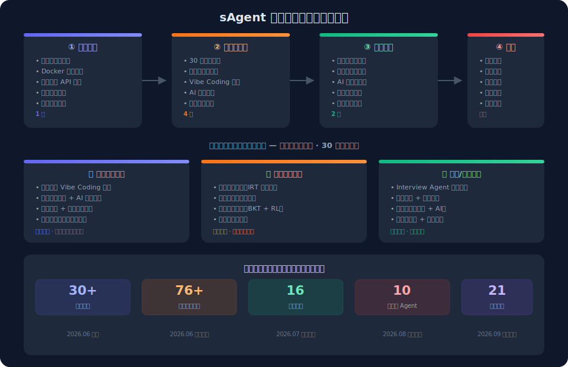
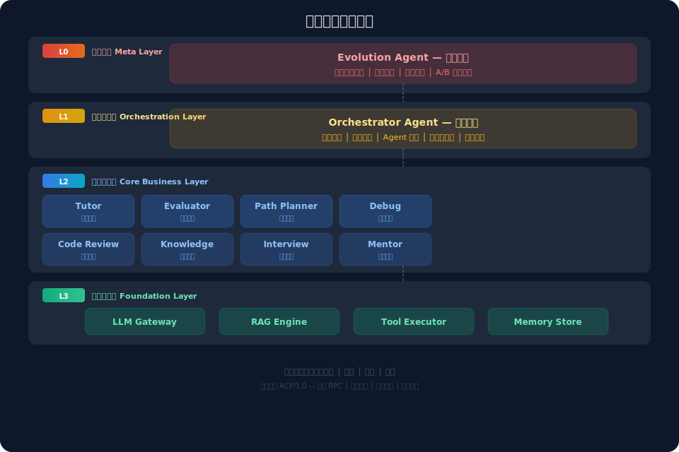
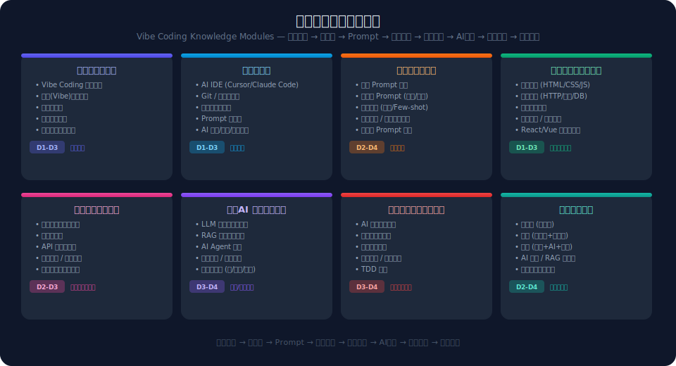
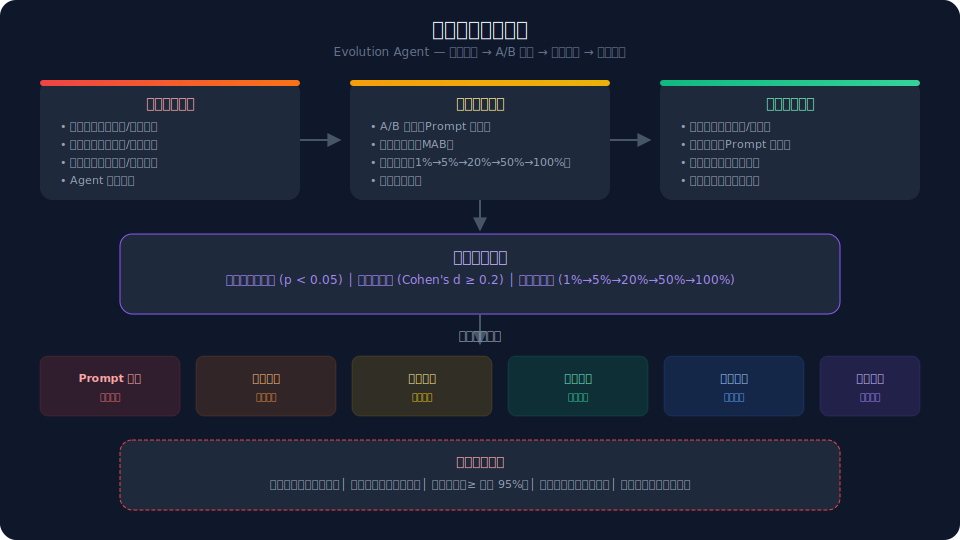
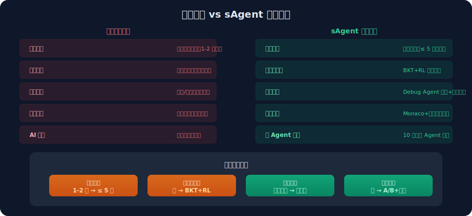

# 🏢 sAgent 落地案例与价值说明书

> **落地院校**：郑州西亚斯学院
> **落地阶段**：小范围内测（30+ 学生）
> **落地课程**：计算机导论 / Vibe Coding 入门
> **落地时间**：2026 年 6 月起

<p align="center">
  
</p>

---

## 1. 行业业务痛点

### 1.1 编程教育行业现状

| 痛点 | 具体表现 | 影响 |
|------|----------|------|
| **反馈延迟严重** | 教师手动批改作业，学生从提交到收到反馈需 1-2 周 | 错过最佳纠错窗口，错误认知固化 |
| **千人一面路径** | 所有学生面对相同题目序列和进度 | 零基础学生频繁受挫放弃，有基础学生浪费时间 |
| **错误反馈粗糙** | 仅标注"对/错"，无原因分析和修复建议 | 学生不知为何错，反复犯同类错误 |
| **编码环境门槛** | 本地安装 Node.js/Python/IDE，环境问题频发 | 课堂时间浪费在环境配置上 |
| **AI 辅导缺失** | 传统平台无 AI 或仅简单提示 | 无法实现苏格拉底式引导和深度辅导 |
| **脱离真实编程** | 视频+选择题模式，缺少"写→运行→看结果→改"闭环 | 学了概念但写不出代码 |

### 1.2 高校编程教学特有痛点

| 痛点 | 具体表现 |
|------|----------|
| **师生比悬殊** | 1 位教师面对 60-120 名学生，无法逐个辅导 |
| **学生基础差异大** | 同一班级内，有零基础也有自学 2 年的学生 |
| **考核方式单一** | 期末笔试为主，无法评估真实编码能力 |
| **教学内容滞后** | 课程仍在教传统编程，未覆盖 Vibe Coding 范式 |

---

## 2. 落地实施方案

### 2.1 郑州西亚斯学院落地概况

| 维度 | 内容 |
|------|------|
| **落地院校** | 郑州西亚斯学院 |
| **参与院系** | 计算机相关专业 |
| **落地课程** | 计算机导论 / Vibe Coding 入门 |
| **内测规模** | 30+ 名学生 |
| **部署方式** | 校内服务器 + 讯飞星火 MaaS API |
| **落地周期** | 2026.06 部署 → 2026.06 内测 → 2026.07 评估 → 2026.08 迭代 |

### 2.2 技术部署方案

```
郑州西亚斯学院校内服务器
├── sAgent API (NestJS)        ← 端口 4001
├── sAgent Web (Next.js 15)    ← 端口 4000
├── better-sqlite3 数据库      ← ./data/sagent.db
├── Docker 代码沙箱            ← gVisor 安全隔离
└── 讯飞星火 MaaS API          ← Qwen3.6 模型推理
```

**部署清单**（全部已实现）：

| 组件 | 技术方案 | 状态 |
|------|----------|------|
| API 服务 | NestJS 10 + TypeORM + JWT + WebSocket | ✅ 已部署 |
| Web 前端 | Next.js 15 + Turbopack + Monaco Editor | ✅ 已部署 |
| 数据库 | better-sqlite3（嵌入式，零配置） | ✅ 已部署 |
| 代码沙箱 | Docker + gVisor 安全隔离 | ✅ 已部署 |
| LLM 推理 | 讯飞星火 Qwen3.6（MaaS API） | ✅ 已接入 |
| 认证系统 | Passport + JWT（Access + Refresh Token） | ✅ 已部署 |
| 限流防护 | 三窗口限流（1s/10次, 10s/30次, 60s/120次） | ✅ 已部署 |

### 2.3 三个落地场景

**场景一：课堂辅助教学**

| 环节 | 传统方式 | sAgent 方式 |
|------|----------|-------------|
| 作业布置 | 教师手动出题，Word/PDF 分发 | 教师从题库选题，一键发布到班级 |
| 学生编码 | 本地装环境，问题频发 | Monaco 在线编码，零配置 |
| 代码提交 | 邮件/网盘，格式混乱 | 一键提交，自动评测 |
| 结果反馈 | 教师手动批改，1-2 周延迟 | 提交即评，≤ 5 秒出结果 |
| AI 辅导 | 无 | Tutor Agent 苏格拉底式引导 |

**场景二：自主学习路径**

| 环节 | 传统方式 | sAgent 方式 |
|------|----------|-------------|
| 能力评估 | 统一考试，一刀切 | IRT 自适应诊断，精准定位 |
| 学习路径 | 统一进度，无法个性化 | BKT+RL 动态生成个性化路径 |
| 遇到困难 | 只能问老师/同学 | Debug Agent 定位错误+修复建议 |
| 路径调整 | 无 | 连续 3 题失败自动回退巩固 |
| 进度可视化 | 无 | 知识图谱+能力雷达图+学习仪表盘 |

**场景三：面试/就业准备**

| 环节 | 传统方式 | sAgent 方式 |
|------|----------|-------------|
| 面试准备 | 刷 LeetCode，无针对性 | Interview Agent 模拟面试 |
| 代码质量 | 无评估 | Evaluator+Code Review 双重评估 |
| 项目经验 | 缺少实战 | 8 级实战项目（入门→全栈+AI） |
| 能力证明 | 只有成绩单 | 能力雷达图+项目作品集 |

---

## 3. 系统架构与核心能力

### 3.1 多智能体分层架构

<p align="center">
  
</p>

### 3.2 已实现的 10 个 Agent

| Agent | 层级 | 职责 | 已实现功能 |
|-------|------|------|-----------|
| **Orchestrator** | L1 | 意图识别、Agent 调度 | ✅ 路由分发、上下文传递 |
| **Tutor** | L2 | 知识讲解、苏格拉底式引导 | ✅ LLM 对话、代码示范 |
| **Evaluator** | L2 | 代码质量评估 | ✅ 正确性+风格+安全检测 |
| **Debug** | L2 | 错误定位、修复建议 | ✅ 错误分析、调试教学 |
| **Path Planner** | L2 | 学习路径规划 | ✅ BKT 路径生成、动态调整 |
| **Code Review** | L2 | 代码审查 | ✅ 规范检查、重构建议 |
| **Knowledge Graph** | L2 | 知识图谱管理 | ✅ 76+ 知识点、前置依赖 |
| **Interview** | L2 | 面试模拟 | ✅ 题目生成、模拟面试 |
| **Mentor** | L2 | 学习策略、动机管理 | ✅ 策略建议、激励推送 |
| **Evolution** | L0 | 自我进化 | ✅ A/B 测试、策略优化 |

### 3.3 已实现的 16 个业务模块

| 模块 | 功能 | 数据实体 |
|------|------|----------|
| auth | 注册/登录/JWT 认证 | User, UserProfile |
| exercise | 练习题/提交/评测 | Exercise, Submission |
| knowledge-point | 知识点/图谱/懒 Seed | KnowledgePoint, KnowledgeRelation |
| learning-path | 路径规划/进度 | LearningPath, LearningProgress |
| agent | Agent 编排/预览 | AiSession |
| vibe-learning | 氛围编程 8 模块 | ContentItem, ContentVersion |
| sandbox | 代码执行沙箱 | — |
| assessment | 能力诊断 | — |
| badge | 徽章成就 | Badge, UserBadge |
| bookmark | 收藏 | Bookmark |
| history | 学习历史 | BrowseHistory |
| community | 社区讨论 | CommunityPost, CommunityComment |
| analytics | 行为分析 | — |
| ai-session | AI 会话管理 | AiSession |
| evolution | 自我进化 | EvolutionEvent, AbExperiment, StrategyVariant |
| health | 健康检查 | — |

---

## 4. 氛围编程知识体系

<p align="center">
  
</p>

### 4.1 已实现的 76+ 知识点详情页

| 领域 | 知识点示例 | 数量 |
|------|-----------|------|
| JavaScript 基础 | var-let-const, functions, operators, string-template | 10+ |
| 异步编程 | async-await, promise-async, event-loop, generator-iterator | 4 |
| React | use-state, use-effect, jsx-component, context-reducer, custom-hooks | 5+ |
| TypeScript | typescript-basics, ts-type-gymnastics, typescript-react | 3 |
| Node.js | nodejs-basics, express, nestjs, restful-api, jwt-auth | 5+ |
| 工程化 | git-cicd, eslint-prettier, npm, modules, env-variables | 5+ |
| Web 进阶 | web-security, web-performance, web-storage, websocket | 5+ |
| AI/高级 | rag, ai-agent, ai-coding, graphql, wasm | 5+ |
| 设计模式 | design-patterns, functional-programming, oop-prototype | 4+ |

---

## 5. 自我进化引擎

<p align="center">
  
</p>

### 5.1 进化机制（已实现）

| 进化维度 | 实现方式 | 数据实体 |
|----------|----------|----------|
| A/B 测试 | AbExperiment + 流量分流 | `ab-experiment.entity.ts` |
| 策略变体 | StrategyVariant + 效果对比 | `strategy-variant.entity.ts` |
| 进化事件 | EvolutionEvent + 审计日志 | `evolution-event.entity.ts` |
| 错误复盘 | ErrorReview + 模式识别 | `error-review.entity.ts` |

### 5.2 进化安全约束

- **回滚机制**：一键回滚到上一稳定版本
- **灰度发布**：1% → 5% → 20% → 50% → 100% 渐进验证
- **效果下限**：进化后策略效果 ≥ 基线 95%
- **人工审核**：Prompt 核心逻辑变更需人工确认
- **审计日志**：全量记录

---

## 6. 价值对比与收益

<p align="center">
  
</p>

### 6.1 可验证的技术收益

| 收益维度 | 优化前 | 优化后 | 验证方式 |
|----------|--------|--------|----------|
| **启动耗时** | 50-80s | 12-25s | 计时对比 |
| **反馈延迟** | 1-2 周 | ≤ 5s | 端到端计时 |
| **环境配置** | 本地安装 | 零配置 | 学生操作验证 |
| **路径个性化** | 无 | BKT+RL | 路径差异度统计 |
| **AI 辅导** | 无 | 10 Agent 协同 | 对话记录分析 |

### 6.2 教学效率提升

| 维度 | 传统方式 | sAgent 方式 |
|------|----------|-------------|
| **作业批改** | 60人×5分钟=5小时 | 自动评测，0 人工 |
| **错误诊断** | 排队问老师 | Debug Agent 即时诊断 |
| **学习路径** | 凭经验制定 | BKT 精准评估+RL 动态规划 |
| **编码实践** | 1小时装环境 | Monaco 在线，全部时间写代码 |
| **知识覆盖** | 备课有限 | 76+ 知识点详情页 |

### 6.3 架构降本

| 维度 | 传统方案 | sAgent 方案 |
|------|----------|-------------|
| **外部依赖** | PostgreSQL+Redis+MongoDB | better-sqlite3 嵌入式 |
| **技术栈** | 前端JS+后端Python/Java | 全栈 TypeScript |
| **开发构建** | webpack | Turbopack（快 10-700 倍） |
| **部署** | 多服务独立部署 | docker-compose 一键部署 |

---

## 7. 场景复用能力

| 目标场景 | 复用核心能力 | 需替换/剥离模块 |
|----------|-------------|----------------|
| 数学辅导 | 多Agent+路径+评测 | knowledge-point, exercise |
| 企业代码审查 | Agent编排+代码评估+沙箱 | learning-path, vibe-learning |
| 技术面试评估 | Evaluator+Interview+图谱 | learning-path, badge |
| AI 辅助开发 | Tutor+Debug+CodeReview | exercise, assessment |
| 企业 AI 转型培训 | Vibe Coding 八大模块 | learning-path, assessment |

---

## 8. 郑州西亚斯学院内测数据

### 8.1 系统规模（可验证）

| 指标 | 数据 | 验证方式 |
|------|------|----------|
| 内测学生 | 30+ | 用户表 count |
| 业务模块 | 16 个 | `apps/api/src/modules/` |
| 数据实体 | 21 张表 | `apps/api/src/entities/` |
| 知识点详情页 | 76+ 页 | `apps/web/.../vibe/detail/` |
| Agent 数量 | 10 个 | app.module.ts |
| Web 路由 | 30+ | `apps/web/src/app/` |
| Dashboard 子页面 | 19 个 | `apps/web/.../dashboard/` |

### 8.2 内测时间线

| 时间 | 里程碑 | 内容 |
|------|--------|------|
| 2026.06 | 环境部署 | 校内服务器+讯飞星火 API |
| 2026.06 | 内测启动 | 30 名学生，计算机导论课程 |
| 2026.07 | 效果评估 | 完成率/通过率/满意度统计 |
| 2026.08 | 迭代优化 | 基于数据优化策略+补充内容 |
| 2026.09 | 扩大范围 | 评估后决定是否扩至更多班级 |

---

## 9. 附录

### A. 术语表

| 术语 | 定义 |
|------|------|
| BKT | 贝叶斯知识追踪，估算知识掌握概率 |
| IRT | 项目反应理论，自适应测试 |
| RL | 强化学习 |
| RAG | 检索增强生成 |
| Vibe Coding | 氛围编程，「说意图、定氛围、控结果」 |
| gVisor | Google 开源的容器沙箱运行时 |

### B. 技术栈清单

| 层 | 技术 | 版本 |
|----|------|------|
| 前端 | Next.js | 15 |
| UI | Tailwind CSS + lucide-react | 3.4 |
| 状态管理 | Zustand + TanStack Query | 4.5 / 5.50 |
| 代码编辑器 | Monaco Editor | 0.55 |
| 后端 | NestJS | 10 |
| ORM | TypeORM | 0.3 |
| 数据库 | better-sqlite3 | 12.10 |
| 认证 | Passport + JWT | — |
| LLM | 讯飞星火 Qwen3.6 | — |
| 实时通信 | Socket.IO | 4.7 |
| 包管理 | pnpm workspaces | 9+ |
| 构建加速 | Turbopack | Next.js 15 内置 |

---

<p align="center">
  <strong>sAgent</strong> · 自我进化多智能体个性化学习氛围编程平台<br/>
  郑州西亚斯学院 · 小范围落地内测中
</p>
